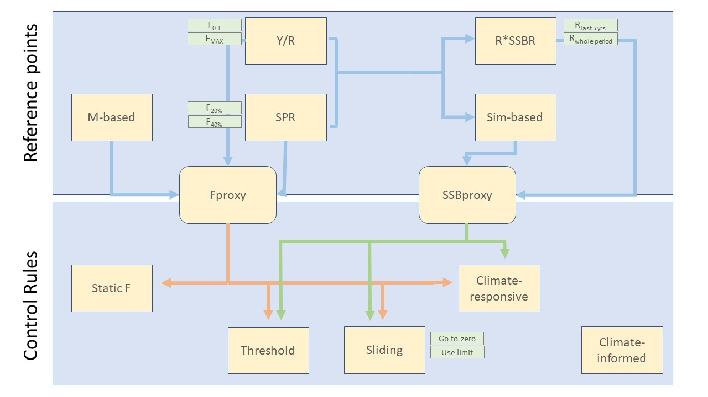

<!-- #region -->
**Description of the management strategy evaluation framework for New England groundfish**

**1\. Introduction**  
Management strategy evaluation (MSE) is a general framework aimed at simulation testing management procedures (MPs). This model framework involves simulating the natural and human aspects of the managed fishery resource system under different circumstances and evaluating performance based on management objectives. A key advantage of the approach is that the operating model (OM) provides a representation of ‘true’ population dynamics and a baseline for comparison of performance across estimation approaches and alternative MPs. MSE can identify the performance of an existing MP and can allow for comparisons across alternative MPs based on metrics that reflect management objectives. Additionally, trade-offs among management objectives achieved by different HCRs can be evaluated while explicitly accounting for uncertainty (Dichmont et al., 2008). This approach is valuable for identifying MPs that are robust to natural variation in the system and to uncertainty and error, both in stock assessments (e.g., retrospective patterns) and implementation (ICES, 2020).

In the MSE framework,  (1) the OM represented the true fish population dynamics and was the basis for evaluating performance relative to the ‘true’ values for the stock and fishery (Fig. 1).  Recruitment, growth, mortality and the assessment-management procedure process are modeled together so that the feedback from the management strategies on the population can be quantified. The management components included are the stock assessment model, calculation of any necessary biological reference points for the management procedure, projections for catch advice, and the harvest control rule. Some of the management procedure components have the capacity to incorporate the types of environmental changes that are built into the simulations. The model can only approximate the order and timing of events in the population and management complex. Recruitment occurs instantaneously at the beginning of each year, immediately followed by instantaneous growth. Fishing and natural mortality then operate through the rest of the year from Jan 1 – Dec 31. Management (i.e., assessment and regulation-setting) occurs at the end of the year and rules (i.e., fishing mortality in the next year) are implemented on Jan 1. There is an option to incorporate a lag in information to the stock assessment. With the lag, the simulation process was designed to be consistent with current New England groundfish management whereby the stock assessment performed in year t has a terminal year of t-1, and the resulting catch advice is for year t+1 and greater depending on the stock assessment frequency. Note that this MSE approach is not a full MSE until management objectives are identified and prioritized.

![Figure 1. Schematic of operating model.  Population processes growth and recruitment occur instantaneously at the beginning of the year while mortality occurs continuously throughout the year.  Temperature has the potential to impact each of the population processes and to be built directly into the management procedures. If desired, historical trajectories can be reconstructed by incorporating recruitment and F time series from the most recent stock assessments and calculating SSB and catch as emergent properties.  ](./images/flow.jpg)

**2\. Population dynamics**  
The OMs are age-structured, stochastic models.

**2\.1 Length-at-age**  
Length-at-age is modeled using the von Bertalanffy function:

where  is length at age  in year ,  is the asymptotic size,  is the Brody growth coefficient and  is a nuisance parameter that accounts for growth at small sizes.  and  are environmental (i.e., temperature) parameters that impact  and , respectively, and is the temperature anomaly in year  (thus, to turn off the temperature effect the $/beta$ parameter may be set to 0). For simplicity and ease of interpretation, typically either  or  would be zero, meaning that temperature would either affect  or  but not both simultaneously.

**2\.2 Weight-at-age**  
Weight-at-age can be an input based on a vector (constant overtime) or matrix (time-varying) or follow exponential growth of the form:

where  is weight at age  in year ,  is length at age  in year , and  and  are parameters.  The parameters  and  are not time varying (i.e., there is no direct temperature effect).  However, the weight-at-age will change over time with length-at-age.

**2\.3 Maturity-at-age**  
Maturity-at-age follows a logistic pattern of the form:

where  is the maturity of age  in year  and  and  are stock-specific parameters.  Specifically,  represents the length at which 50% of individuals are mature and  defines the slope of the logistic function.  is the length of individuals at age  in year .

**2\.4 Recruitment**  
Recruitment can be modeled in several different ways: Beverton-Holt stock-recruitment relationship (steepness implementation or standard implementation) or cumulative distribution functions. The equation for the steepness implementation of the Beverton-Holt stokc-recruitment relationship is

The steepness model includes  and  (typically  and  in this parameterization). These parameters  have been adapted for temperature in year  (see below).  is the spawner biomass-per-recruit at .  is re-calculated when determining recruitment and so  is updated in each year.  is

while  is

where  is 

The  parameterization is used here for convenience when fitting the steepness model externally -- this parameterization is useful to keep $h$ within its appropriate bounds (i.e., between 0.2 and 1.0).  See Weston (2018) for details on this parameterization.

**2\.5 Natural mortality**  
Natural mortality can be constant across ages and time. Natural mortality can also increase overtime. 

**2\.6 Exponential survival**  
Annual mortality for ages $a<a^P$ (where $a^P$ is the plus age) is modeled using exponential survival as

where  is the January 1 numbers-at-age a in year ,  is fishing mortality,  is natural mortality and  is fishery selectivity (see Section 3.1). Plus group abundance in year  is

**2\.7 Historical period**  
If desired, historical trajectories can be reconstructed by incorporating recruitment and F time series from the most recent stock assessments and calculating SSB and catch as emergent properties. 

**3\. Fishery dynamics**  
Fishery dynamics include the model components related to the fishery: calculation of selectivity, catch, effort, etc.  

**3\.1 Fishery selectivity**  
Fishery selectivity is an input as a vector or a logistic function of the form:

(note the different parameterization than for length-maturity) where  is the fishery selectivity of age  fish in year  and  and  are parameters that together govern the position of the curve and its slope.

**3\.2 Fishery catchability**  
Fleet catchability ( below) is constant overtime.

**3\.3 Catch**  
Fishery catch in numbers is defined by the Baranov catch equation:

where  is the catch of age-a fish in year  in numbers,  is the fully selected fishing mortality in year  and  is the number of age-a individuals in the population in year .  Catch in weight  is

As implied by this equation there is no difference in weight-at-age between the population and that observed in the fishery catch.

**3\.4 Fishing effort**  
Effort is a derived quantity, and is used only as an output for use in the stock assessment model.  Effort is:

where  is the fishing effort in year  and  is the fishery catchability.

**4\. Fishery-independent survey**  
Each simulation year there is a fishery-independent survey that is used in the assessment. Time of year for the survey can be set in the model parameter file.

**4\.1 Survey selectivity**  
Survey seletivity is an input as a vector (constant overtime).

**4\.2 Survey catchability**  
Survey catchability can be constant or decrease with increasing temperature. If decreasing with temperature, survey catchability decreases to half of the original survey catchability by the end of the MP period.

**4\.3 Survey catch**  
Survey catch is modeled as:

where  is the survey catch in numbers for age class  in year ,  is the survey selectivity,  is the survey catchability, and  is the survey timing, given as a proportion of the year that has elapsed before the survey occurs.

**5\. Observations**  
Observations of population and fishery quantities are generated with error for use in the assessment model.  The errors are either lognormal or multinomial.

**5\.1 Lognormal error structure**  
Observations of magnitude (e.g., numbers or weight) are lognormally distributed.  A single lognormally distributed observation can be written:

where  is the observation,  is the mean and  is the standard deviation.   is the lognormal bias correction which ensures that the  have an expected arithmetic mean of .

**5.2 Multinomial error structure**  
Observations of age composition assume multinomial errors

where  is a vector of observed numbers-at-age,  is a vector of true proportions-at-age, and  is the effective sample size.

**5.3 Application of error structures to data sources**  
The error structures associated with each of the data streams that are output to the assessment model are given in the table below.  

| Data stream               | Error structure |
|---------------------------| ----------------|
| Total catch weight        | lognormal       |
| Catch proportions-at-age  | multinomial     |
| Survey index              | lognormal       |
| Survey proportions-at-age | multinomial     |
| Fishing effort            | lognormal       |

**6. Management Procedures**  
Management procedure in this context refers to the method for determining the fishing mortality rate in subsequent years.  The harvest control rule objectively dictates the actions that are to be undertaken under specific conditions while biological reference points parameterize the rules (if applicable – some harvest control rules do not depend on reference points).  

**6.1 Stock assessment methods and specifications**  
The assessment models estimate population status.  These estimates are then input into the harvest control rule function to determine a management action for the next year or years.  Both sophisticated (statistical catch-at-age) and simple (plan B smooth) models are used here in competing scenarios .

**6.1.1 Catch-at-age model**  
The catch-at-age (CAA) model was written in Template Model Builder, a software adept at fitting complex nonlinear models.  The estimated parameters are recruitment deviations, initial population parameters, fishery and survey catchability and commercial selectivity parameters.  All parameters that are biologically constrained to be positive (e.g., initial population size or catchability) were estimated on a log scale.  Much of CAA model follows the same structure as the operating model.  This includes logistic fishery selectivity (Eqn. XXXX), flat survey selectivity, exponential survival (Eqn. XXXX), and use of the catch equation to estimate fishery catch (Eqn. XXXX).  A few processes differ from their parameterization in the operating model; these are listed in this section.

**6.1.1.1 Initial population size**  
The initial population is estimated as a mean and a set of deviations

where  is the initial population size for age ,  is the log-scale mean population size and  are the age deviations.

**6.1.1.2 Recruitment**  
Recruitment is parameterized as a random walk

Where  is recruitment in year  and  is the random walk deviation for year $.

**6.1.1.3 Likelihood function**  
The model log likelihood is

where  is the total log likelihood and the $L^x$ components are for catch, the survey index, recruitment deviations, the commercial proportions-at-age and the survey proportions-at-age, respectively.  The commercial catch and survey index assume normally distributed observation errors around the log-scale predicted values.  The general equation is

where  is the observed catch or index value for year ,  is the predicted catch or index value, and  is the fixed standard deviation (i.e., observation error) for the catch or survey index.  The observation error level is currently set at the true value used in the operating model but estimation for these parameters can be turned on.

Likelihood for the recruitment random walk deviations also are assumed to be normally distributed, but around zero

where  is the fixed standard deviation for the recruitment deviations.
The proportions-at-age for the commercial fishery and survey index are multinomial distributed

where  is the log likelihood for the commercial fishery or survey proportions-at-age,  is a vector of observations in year ,  is a vector of predictions in year , and  is the effective sample size for the commercial fishery or survey.  The effective sample size is fixed at the level used to generate errors in the operating model.

**6.1.2 Index-based model**  
We include an index-based assessment model for comparison to the catch-at-age version. We use the Plan B approach that has been applied to groundfish in the northeast US (see <https://github.com/cmlegault/PlanBsmooth>). This method fits a linear model to a loess smoothed time series of the last three years of index data on a log scale

where  is the predicted index data,  and  are linear model parameters intercept and slope, respectively. An arithmetic scale multiplier is then calculated . Catch advice in year  is then .

where  is the predicted index data,  and  are linear model parameters intercept and slope, respectively. An arithmetic scale multiplier is then calculated . Catch advice in year  is then .

**6.1.3 Age-Structured Assessment Program (ASAP)**  
ASAP (Legault & Restrepo, 1998) is what is currently used for the majority of analytical groundfish stock assessments in the region. 

**6.1.4 Stock assessment misspecifications**  
To evaluate the impact of stock assessment model misspecifications, scenarios with incorrect stock assessment assumptions can also be simulated. Options included are recruitment, natural mortality, weight-at-age, and survey catchability misspecifications.

**6.2 Biological reference points**  
Many harvest control rules require reference levels for the stock that define the objective decision-making (i.e., parameterize the control rule).  These usually involve an F-based reference point and/or a biomass-based reference point.

A schematic giving the relationship among some of the reference points is given below.  

In these examples, the F-based reference points (e.g., those derived from Y/R or SPR models) serve as the foundation for parameterization of the harvest control rules.  The F proxy parameters are taken directly from these reference levels and the Biomass-based proxies use them in determining the biomass reference points.
Other methods for biomass-based reference points include stock-recruit models and surplus production models but those are not included here.

**6.2.1 F proxy methods**  
Described here are methods to define target $F$ reference points.

**6.2.1.1 Yield-per-recruit**  
Yield-per-recruit is available as an option in the model to generate a proxy for $F_{MAX}$.  Yield-per-recruit is an equilibrium method that identifies the expected yield at each potential fishing mortality rate for an average individual in the population given schedules of selectivity and weight-at-age.  The equation is

where  is the terminal age and  is a candidate fully selected fishing mortality rate.  A range of candidate fishing mortality rates (e.g., from 0.0 to 2.0) are substituted for  so each potential value of  has an associated yield-per-recruit.  The yield-per-recruit reference point considered here is F0.1 which is the $F^*$ where the slope of the yield-per-recruit curve is 1/10 the slope at the origin.  In the simulation, parameters such as weight-at-age or selectivity-at-age can change; for the reference point calculations the values-at-age that are used are those from the year before the management update will occur (i.e., the most recent year available).

**6.2.1.2 Spawning potential ratio**  
Spawning potential ratio is based on a similar dynamic pool function, spawning stock biomass-per-recruit.  That equation is

Where  is the estimated spawning stock biomass per recruit at fishing mortality level  for an average individual.  The spawning potential ratio is the ratio of  at at  to  a given level of 

Spawning potential ratio is set to a particular level (e.g., 35% or a ratio of 0.35) and the level of  that results in the given ratio is the  proxy reference point.

**6.2.1.3 Simulation-based $F_{MSY}$**  
A "true" value for  can be found using a grid search. Starting with the initial conditions for year  in the model, candidate values for  are tested by running a projection for  years. Assuming this rate of fishing mortality, the population is projected out using a simple age-structured model with input parameters selectivity, weight-at-age and maturity schedules and natural mortality rate. Recruitment is specified either as a constant value that is a function (e.g., the mean) of stock assessment model output or as a function of the available spawner biomass (and possibly temperature if that functionality is switched on). Potential values for  run from 0 to 2.0 and the total yield (catch biomass) in each year is saved.  is specified as the value from the  grid that results in the maximum total yield.

**6.2.2 Biomass proxy methods**  
Described here are methods that define biomass-based reference points.  These could be thought of either as targets or limits depending on the control rule (see Section 6.2).

**6.2.2.1 Spawning stock biomass-per-recruit-based**  
One method to define a biomass-based reference point is to define a target level of fishing mortality  and then use the equilibrium spawning stock biomass-per-recruit at that fishing mortality level and a measure of expected recruitment to define the reference point.  The equation is

Where  is the target spawning stock biomass,  is the spawning stock biomass per recruit at the  target level.   is a flexible function and  a flexible definition of recruitment.  For example,  could be the mean, geometric mean or median and  could be the entire recruitment time series or the last 5 or 10 years of recruitment.
Note that this method is dependent on the method/level chosen for the  target.  Thus if the level of  was chosen based on , the biomass reference point  would be different than if  was chosen based on .

**6.2.2.2 Simulation-based**  
Another method to define  is using simulation.  In this approach, again  is defined using one of the  proxy methods.  Then, assuming this rate of fishing mortality, the population is projected out using a simple age-structured model with input parameters selectivity, weight-at-age and maturity schedules and natural mortality rate.  Recruitment is randomly selected from the time series (or a truncated version of the time series such as the last 10 years).  The population will eventually reach a dynamic equilibrium (i.e., will be variable because recruitment is changing but will not be a function of the initial conditions).  The average spawner biomass during the equilibrium phase is .

**6.3 Harvest control rules**  
Harvest control rules define the objective decisions that are made within the management process.  Often (though not always depending on the type of rule) they are parameterized using biological reference points. All HCR alternatives include a constraint on catch advice so that it will not be higher than the estimated catch that corresponds to the estimated overfishing limit (OFL) from the stock assessment to emulate the current in-season quota monitoring system for New England groundfish. 

**6.3.1 Ramp control rule**  
The ramp (sliding) control rule does not cut off fishing completely when estimated biomass is below BMSY but reduces it in proportion to the stock status.  One assumption about this rule is the idea that the population will naturally fluctuate about BMSY so the ramping-down should not necessarily occur immediately. The intention of this HCR is to promote rebuilding and optimal yield. The rule is
 if  else

where  is the current spawner biomass and  is the proportion of Bmsy at which the stock is considered overfished.
The ramp rule described here goes through the origin; similar rules are possible that reduce fishing mortality to zero below a certain biomass level (i.e., a limit).  In that case, the slope of the ramp would be larger than that described here.

**6.3.2 Binary threshold control rule**  
A binary threshold rule also uses both $F$-based and biomass-based target reference points, but in this case there is no ramp.  The rule is simply
 if  B_{MSY}">  else 

so fishing is stopped completely when stock spawner biomass is estimated to lie below the target.

**6.3.3 Constant fishing mortality**  
A constant fishing mortality rule only involves an F-based reference point.  This rule is

**6.3.4 Climate-responsive control rules**  
Climate-responsive control rules are re-parameterized given updates in the biological reference points.  For example, a changing environment might alter the weight-at-age schedule which would directly impact yield-per-recruit- or spawning potential ratio-based reference points.  Any of the biological reference point methods in Section 6.1 could be updated as a function of changing conditions.  As an example, the ramp control rule could change to
 if  else 

The change is in the  subscripts, which indicate that reference points that parameterize the control rule may change over time.

**6.3.5 Climate-informed control rules**  
Climate-informed control rules directly incorporate environmental effects to parameterize the control rules (as opposed to indirectly through updates of biological reference points).  For example, Hurtado-Ferro et al. (2010) test a control rule that modifies the shape of a ramp-like method based on average sea surface temperature, the idea being that temperature determines whether production is occurring in a favorable or unfavorable regime.

**6.3.6 P* harvest control rule**  
The aim of this HCR option is to avoid overfishing by accounting for scientific uncertainty with a probabilistic approach. In this scenario, the P* approach (Prager & Shertzer, 2010) was used to derive target catch. The P* method derives target catch as a low percentile of projected catch at the OFL. The distribution of the catch at the OFL was assumed to follow a lognormal distribution with a CV of 1 (Wiedenmann et al., 2016). The target catch corresponds to a probability of overfishing no higher than 50% (P*<0.5) in accordance with the National Standard 1 guidelines. The level of P* depends on the level of SSB. This alternative emulats HCRs used in the Council’s Small Mesh Multispecies FMP.

**6.3.7 F-step harvest control rule**  
If the SSB decreases below the biomass threshold, this HCR used a target F of 70% FMSY that has recently been applied to some New England groundfish, such as SNE/MA yellowtail flounder and GB winter flounder, as the Frebuild. If the SSB never decreased below the biomass threshold or increased to over SSBMSY (rebuilt) after dropping below the biomass threshold, this HCR used a target F of 75% FMSY. National Standard Guidelines were amended in 2016. These revisions reduced the need to identify an incidental bycatch ABC and indicated that Frebuild need not be recalculated after every assessment, making it less likely that Frebuild will be set to zero in response to short-term lags in rebuilding.

**6.3.8 Constrained ramp harvest control rule**  
The aim of this HCR alternative was to promote rebuilding, optimal yield, and to provide catch stability if stock biomass were to substantially change from year to year. Stable catch was identified as an objective in the Council’s risk policy (NEFMC, 2016). This differs from the ramp HCR in that there was a constraint on variation in target catch from year to year, meaning that the current year’s catch limit will not change more than 20% from the previous year’s catch limit. The threshold of 20% change in catch is in the middle of the range of change in catch thresholds used in HCRs in other fisheries. Catch is constrained so that it was not higher than the perceived OFL. 

**6.4 Projections**  
Projections can be turned on or off. If projections are on, catch advice is generated from projected catch with F determined from the HCR. There are 100 iterations for each projection which incorporates uncertainty in recruitment and the initial abundance derived from the last year of the stock assessment. If there is a lag in the stock assessment information, a ‘bridge’ year is projected to estimate abundance at the beginning of the following year. Initial abundance is drawn from a lognormal distribution with a mean of the final abundance estimate and a standard deviation corresponding to the standard deviations of the total abundance estimates from the most recent stock assessment conducted by the NEFSC. This approach is used in this study because the MSE framework does not use a Monte Carlo Markov Chain (MCMC) approach to estimate uncertainty in the stock assessment models due to computational constraints. For NEFSC stock assessments, a MCMC approach provides multiple realizations of numbers at age that can be used in the projections. F from the previous iteration of the HCR, or the F from the previous year’s catch advice, is used in the ‘bridge year’ to calculate total mortality. Projections are currently used in determining catch advice for almost all New England groundfish with analytical assessments. If there is a lag in information to the stock assessment, stock assessment outputs with a terminal year of t-1 are used in projections at year t to estimate catch advice for year t+1 and year t+2. If there is no lag in information to the stock assessment, stock assessment outputs with a terminal year of t are used in projections to estimate catch advice for year t+1 and year t+2. With no lag in information to the stock assessment, the projections do not have a 'bridge' year.

**6.5 Retrospective pattern adjustments**  
Retrospective pattern adjustments or rho-adjustments (Mohn, 1999; Deroba, 2014) can be turned on or off. A rho-adjustment adjusts stock estimates for retrospective inconsistencies. The terminal estimated SSB is rho-adjusted. 

**6.6 Stock assessment frequency**  
The stock assessment frequency can be adjusted.

**7. Performance metrics**  
To evaluate the performance of alternative MPs, a range of performance metrics are compared, including stock performance, stock assessment performance, and management performance metrics. 

**8. Visualizations**  
Radar charts can be used to summarize results across performance metrics for multiple MPs. Line, box, and Kobe plots are also used to show MP performance.  

**Sources Cited**  
Gabriel, W.L. and Mace, P.M. 1999. A review of biological reference points in the context of the precautionary approach. Proceedings of the fifth national NMFS stock assessment workshop: providing scientific advice to implement the precautionary approach under the Magnuson-Stevens Fishery Conservation and Management Act.  NOAA Tech. Memo. NMFS-F/SPO-40.

Hurtado-Ferro, F., Hiramatsu, K. and Shirakihara, K. 2010. Allowing for environmental effects in a management strategy evaluation for Japanese sardine. ICES J. Mar. Sci. 67: 2012-2017.

Weston, A. 2018. Implications of environmental effects on recruitment in stock assessments and management of Alaskan groundfish fisheries. University of Massachusetts Dartmouth Masters Thesis.

<!-- #endregion -->

<!-- #raw -->

<!-- #endraw -->

<!-- #raw -->

<!-- #endraw -->

<!-- #raw -->

<!-- #endraw -->

<!-- #raw -->

<!-- #endraw -->
